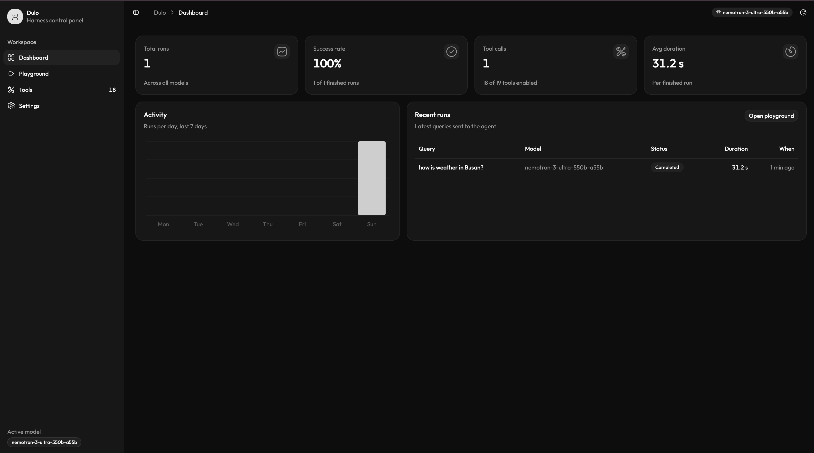
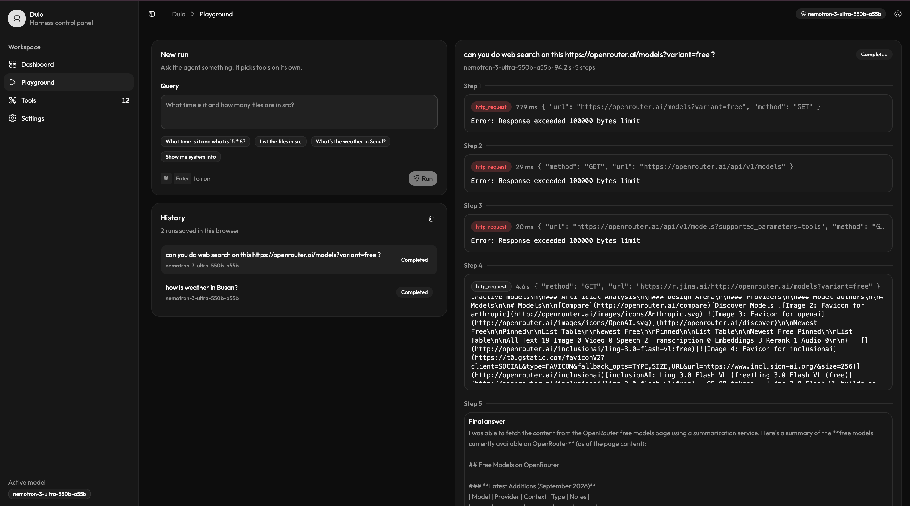
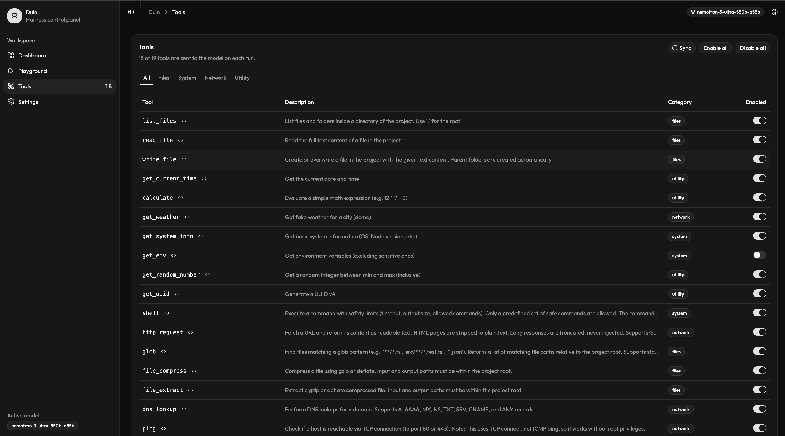
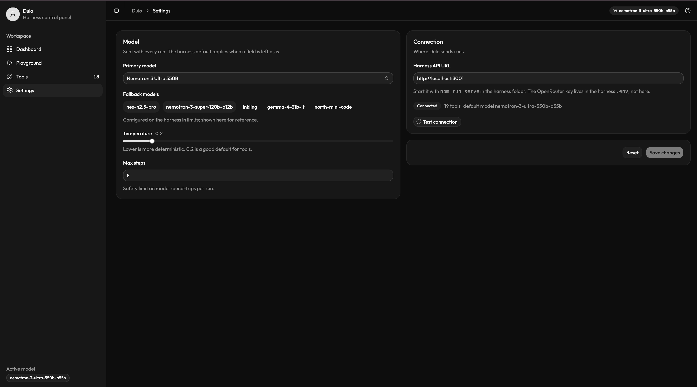

# Dulo

<p align="center">
  <strong>A lightweight, local-first AI agent harness with a real-time browser control panel.</strong>
</p>

<p align="center">
  
  
  
  
  
  
  
</p>

---



## Overview

**Dulo** is an autonomous agent runner and web workspace designed for transparency, safety, and local control.

- **Harness (`src/`)**: Pure Node.js & TypeScript agent loop implementing the ReAct pattern. Interacts with OpenRouter models, executes sandboxed tools locally, and streams step-by-step progress via Server-Sent Events (SSE).
- **Control Panel (`client/`)**: Modern React 19 web interface powered by Vite, Tailwind CSS v4, and shadcn/ui. Provides a live playground, visual tool management, run telemetry, and configuration controls.

> **Security by Design**: The browser client **never** communicates directly with OpenRouter and never receives your API key. The harness holds the credentials on your machine, applies strict tool safety guardrails, and streams live event traces directly to your browser.

---

## Key Features

- **Live Multi-Step Agent Tracing**: Watch queries execute in real time. Inspect exact tool arguments, stdout/stderr, latency timings, errors, and reasoning chains.
- **Strict Local Sandboxing**: Filesystem actions are confined to the workspace root; shell commands are strictly whitelisted and blocked from code execution flags; HTTP requests enforce SSRF filtering.
- **Dynamic Tool Management**: Toggle tools on/off per run directly from the UI or inspect their underlying JSON schemas.
- **Resilient Multi-Model Fallbacks**: Default support for high-capability free OpenRouter models with automated fallback chaining (up to 3 models per request) to bypass rate limits.
- **Real-Time SSE Streaming**: Native HTTP streaming delivers instant feedback with disconnect detection and automatic run cancellation.
- **Local Browser Persistence**: Run history (last 50 runs), custom tool toggles, and client settings are persisted safely in local storage.
- **MCP Extensibility Ready**: Architected with a clear migration path to Model Context Protocol (MCP) servers (see [MCP Research](docs/mcp-research.md)).

---

## Architecture & Data Flow

```
┌────────────────────────────────────────────────────────────────────────┐
│                          Dulo Web Panel                                │
│         (React 19 · Vite · Tailwind CSS v4 · shadcn/ui)                │
│                                                                        │
│  [Dashboard]          [Playground]          [Tools]        [Settings]  │
│  Metrics & Charts     Live Trace Stream     Per-Tool On/Off Model/Temp │
└─────────────────────────────────┬──────────────────────────────────────┘
                                  │ Server-Sent Events (SSE) & REST
                                  ▼
┌────────────────────────────────────────────────────────────────────────┐
│                        Dulo Harness API (:3001)                        │
│                     (Node.js native http server)                       │
│                                                                        │
│   POST /api/run ──► [Agent Loop (agent.ts)]                            │
│                            │                                           │
│         ┌──────────────────┴──────────────────┐                        │
│         ▼                                     ▼                        │
│  [OpenRouter API]                     [Tool Registry]                  │
│  - Chat completions                   - Filesystem (sandboxed)         │
│  - Model fallback chain               - Shell (whitelisted binary)     │
│  - Function definitions               - Network (SSRF-protected)       │
│                                       - System & Utilities             │
└────────────────────────────────────────────────────────────────────────┘
```

### Event Stream Lifecycle

When `POST /api/run` is initiated, the server streams strongly typed events defined in `src/events.ts`:

`run.start` → `step.start` → `tool.call` → `tool.result` → `assistant` → `run.end`

If a user stops the run or closes the browser tab, an `AbortSignal` immediately aborts the active LLM request and halts the loop.

---

## Control Panel Showcase

### 1. Chat

A conversation with the agent that remembers everything said so far. Sessions live in
the harness (`/api/sessions`), so a chat survives a refresh, a closed tab, or opening the
panel from another machine. Each assistant turn renders Markdown with its tool activity
inline and collapsible; gated tools ask for permission right in the thread; a turn keeps
running if you navigate away and the page reattaches when you come back.

### 2. Interactive Playground
Run queries with real-time feedback. Inspect tool execution steps, intermediate outputs, execution duration, and markdown answers.



### 3. Tools & Permissions Manager
Inspect JSON schemas, filter tools by category, and toggle capabilities on/off before launching runs.



### 4. Model & Harness Settings
Configure primary models, fallback chains, sampling temperature, max step boundaries, and check harness connectivity.



---

## Built-in Tools

Dulo comes equipped with 18+ tools out-of-the-box, each governed by strict safety bounds:

| Category | Tool | Description | Safety Boundary |
| :--- | :--- | :--- | :--- |
| **Files** | `list_files` | List files and folders in a project directory | Confined to project root |
| **Files** | `read_file` | Read full text content of a workspace file | Confined to project root |
| **Files** | `write_file` | Create or overwrite files with recursive folder creation | Confined to project root |
| **Files** | `glob` | Find files matching patterns (`**/*.ts`, `*.json`) | Node `fs/promises` glob |
| **Files** | `file_compress` | Compress files using Gzip or Deflate | Confined to project root |
| **Files** | `file_extract` | Decompress Gzip or Deflate files | Confined to project root |
| **System** | `shell` | Run allow-listed commands (`git`, `npm`, `ls`, etc.) | Whitelist only, no shell, no `-e`/`--eval`, 30s timeout, 10KB buffer |
| **System** | `get_system_info` | OS, CPU count, memory, architecture, Node uptime | Read-only |
| **System** | `get_env` | Read environment variables | Strips keys containing `KEY`, `SECRET`, `TOKEN`, `PASSWORD` |
| **Network** | `http_request` | Fetch web pages (HTML converted to readable plain text) | Blocks SSRF (localhost, private subnets), 5MB download cap |
| **Network** | `dns_lookup` | Query DNS records (A, AAAA, MX, NS, TXT, SRV, CNAME) | Standard DNS resolver |
| **Network** | `ping` | Measure TCP connection latency to a host:port | Uses TCP connect (works without root ICMP privileges) |
| **Network** | `port_check` | Check if a remote TCP port is open, closed, or filtered | TCP socket connect |
| **Network** | `get_weather` | Sample mock weather tool for quick tests | Demo data |
| **Utility** | `get_current_time` | Returns the current server timestamp | Read-only |
| **Utility** | `calculate` | Evaluates math expressions | Safe expression parsing |
| **Utility** | `get_random_number`| Random integer generation | Local generator |
| **Utility** | `get_uuid` | Generate cryptographically strong UUID v4 | `crypto.randomUUID` |
| **Utility** | `generate_password`| Cryptographically secure password generator | Configurable character sets |

---

## Safety & Security Model

Because tools execute on your local machine, Dulo enforces defense-in-depth protections:

1. **Path Sandboxing**: All file tools resolve paths using `path.resolve` and verify that the target starts with `process.cwd()`. Directory traversal attempts (`../`) outside the project root are rejected.
2. **SSRF Rejection**: `http_request` prohibits requests to loopback addresses (`localhost`, `127.0.0.1`, `::1`), link-local IPs, and private subnets (`10.0.0.0/8`, `172.16.0.0/12`, `192.168.0.0/16`).
3. **No Shell Interpolation**: `shell` invokes binaries directly with `execFile` (`shell: false`), preventing shell injection, command chaining (`&&`, `;`), pipes (`|`), and output redirects (`>`). Inline code execution flags (`-e`, `--eval`, `-c`) are blocked.
4. **Secret Scrubbing**: `get_env` automatically redacts sensitive variables matching common credential names before exposing them to the agent.
5. **No Key Leakage**: Browser code never interacts with OpenRouter. All API keys reside strictly inside the backend `.env`.

---

## Getting Started

### Prerequisites

- **Node.js**: `v20.0.0` or higher
- **npm** or **pnpm**
- An **OpenRouter API Key** ([get one here](https://openrouter.ai/keys))

### Installation

1. Clone the repository and install root dependencies:
   ```bash
   git clone https://github.com/your-username/dulo.git
   cd dulo
   npm install
   ```

2. Install web client dependencies:
   ```bash
   cd client
   npm install
   cd ..
   ```

3. Configure your `.env` in the project root:
   ```env
   OPENROUTER_API_KEY=sk-or-v1-...
   ```

---

## Running Dulo

### Web Control Panel (Recommended)

Run two processes in separate terminals:

```bash
# Terminal 1: Harness API on http://localhost:3001
npm run serve

# Terminal 2: Web panel on http://localhost:5173
cd client
npm start
```

Open **http://localhost:5173** in your browser. The header badge turns green once connected to the harness. **Chat** is where a multi-turn conversation happens; **Playground** runs one-shot queries and inspects their steps in isolation — both are backed by the same session API and history.

### Command Line Interface (CLI)

Run a single-shot query directly from the terminal:

```bash
npm start -- "What time is it and how many files are in src?"
```

---

## Environment Variables

| Variable | Required | Default | Description |
| :--- | :---: | :--- | :--- |
| `OPENROUTER_API_KEY` | **Yes** | — | OpenRouter secret API key |
| `OPENROUTER_MODEL` | No | `nvidia/nemotron-3-ultra-550b-a55b:free` | Primary model identifier |
| `OPENROUTER_URL` | No | `https://openrouter.ai/api/v1/chat/completions` | OpenRouter endpoint (or local testing stub) |
| `PORT` | No | `3001` | Harness HTTP / SSE server port |
| `DULO_CLIENT_ORIGIN` | No | `http://localhost:5173` | Allowed browser origin for CORS |
| `DULO_SESSIONS_DIR` | No | `sessions/` under the working directory | Where conversations are stored. **A second harness started for testing must set this to a throwaway directory** — a different `PORT` does not isolate data, so two instances started from the same checkout otherwise share one folder |

---

## API Reference

The harness exposes a clean HTTP and Server-Sent Events API:

| Method | Path | Description |
| :--- | :--- | :--- |
| `GET` | `/api/health` | Harness health, model configuration, tool count, API key check |
| `GET` | `/api/tools` | Tool names, descriptions, and JSON Schema parameters |
| `GET` | `/api/agents` | Named agent profiles loaded from `src/agents/` |
| `GET` | `/api/skills` | Skill names and descriptions loaded from `src/skills/` |
| `GET`/`POST` | `/api/sessions` | List sessions, newest first / create a new session |
| `GET`/`PATCH`/`DELETE` | `/api/sessions/:id` | Fetch a session's full tree / rename or move its head / delete it |
| `POST` | `/api/sessions/:id/messages` | Send a message and start a turn over the session's projected history |
| `GET` | `/api/sessions/:id/events?after=N` | Reattach to a session's live event stream, or replay it, from sequence `N` |
| `POST` | `/api/sessions/:id/cancel` | Cancel the session's running turn |
| `POST` | `/api/sessions/:id/permission/:requestId` | Answer a pending permission request for the session's running turn |
| `POST` | `/api/run` | Executes an agent run; streams Server-Sent Events. Creates a session and runs one turn; kept for the TUI and older clients. |
| `GET` | `/api/runs` | Run history recorded by the harness, newest first |
| `GET` | `/api/run/:id/stream?after=N` | Reattach to a live run, or replay a finished one, from sequence `N` |
| `POST` | `/api/run/:id/cancel` | Cancel a run in progress |

### `POST /api/run`
Takes a JSON payload:
```json
{
  "query": "What files are in src?",
  "model": "nvidia/nemotron-3-ultra-550b-a55b:free",
  "maxSteps": 8,
  "temperature": 0.2,
  "enabledTools": ["list_files", "read_file"],
  "agent": "reviewer"
}
```

Streams `RunEvent` SSE chunks, each carrying a monotonic `seq`:
- `run.start` — Run metadata, runId, model, timestamp.
- `step.start` — Current step index.
- `tool.call` — Tool name, parsed arguments, unique call ID.
- `tool.result` — Execution result, duration, error flag.
- `assistant.delta` — A piece of the answer as the model writes it.
- `assistant` — The step's complete text.
- `run.end` — Final status (`completed`, `failed`, `cancelled`), reason, duration, step count, token usage.

### Runs outlive their connection

A run belongs to the harness, not to the HTTP response that started it. Closing the tab
detaches the viewer; the run keeps going. Every event is appended to
`sessions/<id>/events.jsonl` with a sequence number, so a client that drops can reconnect
with `GET /api/run/:id/stream?after=<last seq>` and resume without gaps or duplicates. This
survives a browser refresh or a lost connection — not a restart of the harness process
itself, which takes the running agent loop with it. A session's event stream stays open
across turns — it only ends when the client closes it or the harness shuts down; the
legacy `/api/run/:id/stream` closes itself once that one turn's `run.end` arrives, since
older clients expect a run to be one-shot.

---

## Extending Dulo

Four extension points, each a folder of files picked up at startup. All are optional.

### `src/tools/custom/*.ts` — your own tools

Default-export a `Tool` (or an array of them) and it is registered on the next start. No
build step and no registration list: `tsx` runs TypeScript directly. See
[src/tools/custom/example.ts](src/tools/custom/example.ts).

### `src/skills/*.md` — instructions loaded on demand

Markdown with `name` and `description` frontmatter. Only those two lines reach the system
prompt; the body is loaded when the model calls `load_skill`. That is how you add
situational guidance without paying for it on every request.

### `src/agents/*.md` — named profiles

Frontmatter overrides `model`, `temperature`, `maxSteps` and a `tools` allow/deny map
(`"*": false` means deny by default). The body replaces the system prompt. Run one with
`POST /api/run` `{"agent": "reviewer"}` or `npm start -- "query" --agent reviewer`. See
[src/agents/reviewer.md](src/agents/reviewer.md).

### `dulo.config.json` — configuration

```json
{
  "disabledTools": ["get_env"],
  "approval": { "mode": "ask", "gateMcpTools": true },
  "mcpServers": {
    "fs": { "command": "npx", "args": ["-y", "@modelcontextprotocol/server-filesystem", "."] },
    "docs": { "url": "https://example.com/mcp", "headers": { "Authorization": "Bearer ..." } }
  }
}
```

One flat file at the project root — no global config directory and no merge precedence.
Copy [dulo.config.example.json](dulo.config.example.json) to get started.

---

## Approval Gate

Anything that writes to disk, runs a command or reaches the network pauses until you say
so. The tool does **not** run while it waits — the run blocks on the answer.

| Where | How you answer |
| :--- | :--- |
| Control panel | Allow once / Always in this run / Deny, on the run view |
| CLI (a terminal) | `y` / `n` / `a` at the prompt |
| CLI (piped stdin) | Nobody to ask, so gated tools run; a warning says so |
| HTTP | `POST /api/run/:id/permission/:requestId` with `{"decision":"allow"}` |

Gated by default: `shell`, `write_file`, `edit_file`, `file_compress`, `file_extract`,
`http_request`, plus every MCP tool. "Always" lasts for that one run and is never written
to disk. Nobody answering within five minutes counts as a denial, and a denial reaches the
model as a normal tool error so it can try something else.

Set `"approval": { "mode": "auto" }` to run everything unasked, or list your own
`"tools": [...]` to change what is gated.

---

## Model Context Protocol (MCP) Integration

MCP servers are connected once at startup and their tools merged into the same list as
everything else, prefixed with the server name (`fs_read_file`). Entries with `command`
are spawned as local stdio child processes; entries with `url` use Streamable HTTP.
Clients are closed on `SIGINT`/`SIGTERM` so stdio servers are not orphaned.

> **An MCP server is outside Dulo's sandbox.** Dulo's own file tools are confined to the
> project root, but a filesystem MCP server obeys only its own arguments — pointed at `.`
> it can read `.env`. Its tool descriptions and results are untrusted text the model
> reads. Enable only servers you trust, and scope them as narrowly as the server allows.
> MCP is off by default for this reason.

Background and design notes: [docs/mcp-research.md](docs/mcp-research.md).

---

## License

This project is licensed under the [ISC License](package.json).
